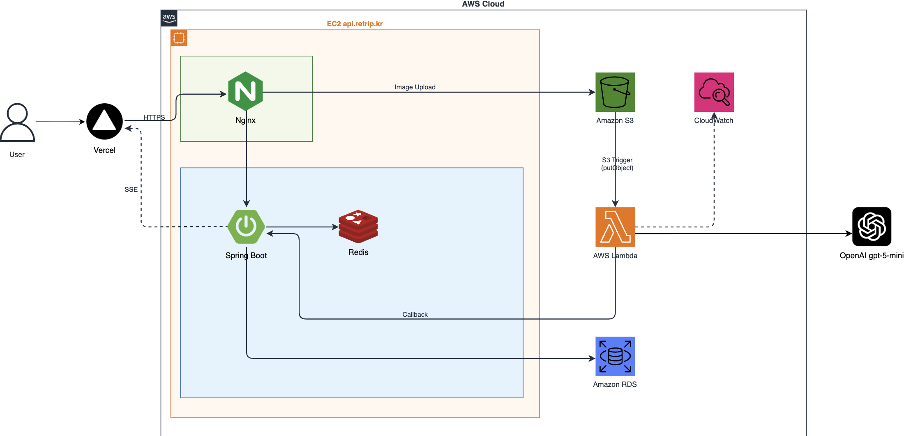

# 🌄 ReTrip - 여행을 요약해주는 새로운 방식의 SNS

ReTrip(Remember Your Trip)은 사용자가 업로드한 여행 사진을 GPT Vision API로 분석하여 여행 성향, 추천 장소, 여행 통계가 담긴 포토카드를 생성하는 이미지 기반 여행 요약 SNS입니다.

<br>

## 팀원 구성

<div align="center">

| **김용범** | **오일우** |
| :------: | :------: |
| [ <br/> @Bumnote](https://github.com/Bumnote) | [ <br/> @Oilwoo](https://github.com/Oilwoo) |

</div>

<br>

## 1. 개발 환경

- **Back-end**: Spring Boot 3.4.5, Java 21, Spring WebFlux (Netty), Spring Data JPA
- **Database**: MySQL 8.0, Redis 7
- **AI/ML**: OpenAI gpt-5-mini Vision API, Spring AI
- **서버리스**: AWS Lambda (Java 21 SnapStart / Python 3.12)
- **인프라**: AWS EC2, AWS S3, Docker, Docker Compose, Nginx, Let's Encrypt (SSL)
- **모니터링**: Prometheus, Grafana, AWS CloudWatch
- **부하 테스트**: k6
- **버전 및 이슈관리**: Github, Github Issues
- **협업 툴**: Discord, Notion

<br>

## 2. 기술 스택 상세

### Backend

| 기술 | 선택 이유 |
|------|----------|
| **Spring WebFlux (Netty)** | OpenAI API 호출 시 스레드 블로킹 없이 논블로킹 I/O 처리 |
| **WebClient** | RestClient(블로킹) 대신 완전 논블로킹 HTTP 클라이언트 |
| **SSE (Server-Sent Events)** | Lambda 처리 완료 후 클라이언트에 실시간 결과 푸시 |
| **Redis** | Lambda 콜백 결과 임시 캐싱 및 SSE 연결 관리 |
| **Spring AI** | OpenAI API 추상화 및 BeanOutputConverter로 타입 안전한 응답 처리 |

### 서버리스 아키텍처

| 기술 | 선택 이유 |
|------|----------|
| **AWS Lambda** | 이미지 처리 + GPT 호출을 EC2에서 분리 → 요청별 독립 컨테이너로 메모리 격리 |
| **Java 21 SnapStart** | Java Lambda 콜드 스타트 (~5초) 단축 → 스냅샷 복원 (~275ms) |
| **Python Lambda** | Java 대비 경량 스택으로 동일 작업 약 49% 빠른 처리 |
| **S3 트리거** | EC2에서 S3 업로드 완료 시 Lambda 자동 호출 |

<br>

## 3. 아키텍처



### 전체 처리 흐름

```
클라이언트
    │
    ▼
[Nginx] ──SSL 종료──▶ [EC2: Spring Boot WebFlux]
                              │
                    ① 이미지 수신 + S3 업로드
                    ② jobId 반환 + SSE 대기
                              │
                    S3 ObjectCreated 이벤트
                              │
                              ▼
                    [AWS Lambda (Java/Python)]
                    ③ S3에서 이미지 다운로드
                    ④ 이미지 리사이징
                    ⑤ GPT Vision API 호출
                              │
                    ⑥ EC2 콜백 (분석 결과 전송)
                              │
                              ▼
                    [EC2: Spring Boot WebFlux]
                    ⑦ Redis 캐싱 + DB 저장
                    ⑧ SSE 푸시 ──▶ 클라이언트
```

<br>

## 4. 프로젝트 구조

```
ReTrip-api/
├── src/main/java/ssafy/retrip/
│   ├── api/
│   │   ├── controller/retrip/        # REST API (이미지 업로드, 콜백 수신)
│   │   └── service/
│   │       ├── retrip/               # 핵심 비즈니스 로직
│   │       ├── s3/                   # S3 업로드 처리
│   │       ├── sse/                  # SSE 실시간 푸시
│   │       ├── cache/                # Redis 캐싱
│   │       └── openai/               # OpenAI API 연동
│   ├── config/                       # Security, Redis, WebClient 설정
│   ├── domain/                       # JPA 엔티티 (Retrip, RecommendationPlace)
│   └── utils/                        # 메타데이터 추출, GPS, 거리 계산
│
├── nginx/                            # Nginx 설정 (SSL, 리버스 프록시)
├── docker-compose.yml                # EC2 컨테이너 구성
└── src/main/resources/
    ├── application.yml
    └── analysis.prompt               # GPT 분석 프롬프트
```

<br>

## 5. 아키텍처 진화 과정

> 동기 통신의 한계를 발견하고, 서버리스 아키텍처로 진화한 과정을 기록했습니다.

| 단계      | 방식 | 결과 | 문제 |
|---------|------|------|------|
| Stage 0 | RestClient 동기 통신 | 30개 중 15개 타임아웃 (50% 실패) | 스레드 블로킹 → HikariCP 고갈 |
| Stage 1 | WebClient 비동기 논블로킹 | 스레드 고갈 해결 | 150장 이미지 단일 JVM 동시 적재 한계 |
| Stage 2 | Java Lambda + SnapStart | 10개 성공, 30개 실패 | OpenAI TPM 200K 초과 (429) |
| Stage 3 | gpt-5-mini + 429 재시도 | **30개 100% 성공** (avg 2분 20초) | 응답시간 다소 길음 |
| Stage 4 | Python Lambda | **30개 100% 성공** (avg 1분 33초) | - |

<br>

## 6. 성능 테스트 결과 (k6, 30 VUs 동시 요청)

### Java SnapStart vs Python Lambda

| 지표 | Java (SnapStart) | Python |
|------|-----------------|--------|
| 성공률 | 100% (30/30) | 100% (30/30) |
| e2e 평균 응답시간 | 3분 04초 | **1분 33초** |
| e2e p(95) | ❌ 4분 13초 (임계값 초과) | ✅ **2분 16초** |
| e2e 최소 | 2분 01초 | **48.61초** |
| e2e 최대 | 4분 17초 | **2분 16초** |
| 폴링 횟수 (요청당) | 35.4회 | **18.3회** |
| 콜드 스타트 | ~275ms (SnapStart) | ~1.2초 |

> Python Lambda가 Java 대비 평균 응답시간 **약 49% 단축** 및 p(95) 임계값(3분) 통과

<br>

## 7. 개발 기간

| 기간 | 내용 |
|------|------|
| 2025-04-28 ~ 2025-05-10 | 백엔드 API 개발 |
| 2025-05-11 ~ 2025-05-20 | AI 모델 연동 |
| 2025-05-21 ~ 2025-05-25 | 인프라 구축 (EC2, S3, Nginx, SSL) |
| 2025-05-26 ~ | 성능 최적화 (Lambda 전환, 부하 테스트) |

<br>

## 8. 역할 분담

### 💁🏻‍♂️ 김용범
- AWS Lambda 아키텍처 설계 및 구현 (Java/Python)
- Spring Boot WebFlux 아키텍처 설계
- RESTful API 개발 및 SSE 실시간 통신
- 성능 테스트 (k6) 및 병목 분석
- Docker 및 EC2 인프라 구성

### 💁🏻‍♂️ 오일우
- 이미지 메타데이터 추출 및 처리
- OpenAI GPT Vision 연동 및 프롬프트 엔지니어링
- 데이터베이스 설계 및 JPA 구현